# CoreBank 미니 코어뱅킹 — DB ERD v3.0

> **DBMS**: MySQL 8.4 / 26개 테이블(25개 비즈니스 테이블 + `ledger_entry_id_sequence` 1개) / 금액 BIGINT · 시각 DATETIME(6)(시간대 없는 벽시각, KST는 애플리케이션 저장·표시 계약)
> **스키마 권한**: Flyway 단독 (`spring.jpa.hibernate.ddl-auto: validate`)

---

```mermaid
erDiagram
    %% =================================================================
    %% CoreBank 미니 코어뱅킹 - DB ERD v1.0
    %% MySQL 8.4 / 26개 테이블 / 금액 BIGINT · 시각 DATETIME(6)(시간대 없는 벽시각, KST는 애플리케이션 계약)
    %% =================================================================

    %% ---------- P6 ----------
    customer {
        bigint customer_id PK
        varchar user_id UK "로그인 아이디"
        char password_hash "BCrypt"
        varchar user_name "VARCHAR(50)"
        date birth_date
        varchar email UK "VARCHAR(100)"
        varchar phone_number "하이픈 없음"
        tinyint login_failure_count "5회 시 잠금 (ATH0102)"
        boolean account_locked
        varchar display_order_type "CUSTOM / OPENED_DATE_ASC"
        datetime last_login_at "대시보드 currentLoginAt"
        varchar last_login_ip "대시보드 currentLoginIp"
        datetime previous_login_at "대시보드 previousLoginAt"
        datetime password_changed_at "DATETIME(6)"
        datetime joined_at "DATETIME(6)"
    }
    terms {
        bigint terms_id PK
        varchar terms_code UK "VARCHAR(30)"
        varchar version UK "VARCHAR(10)"
        varchar terms_type "SIGNUP / PRODUCT"
        varchar title "VARCHAR(200)"
        text content
        boolean is_required
        boolean view_required "전문 열람 강제 (PRD0005)"
    }
    customer_terms_agreement {
        bigint agreement_id PK
        bigint customer_id FK
        bigint terms_id FK
        datetime agreed_at "DATETIME(6)"
    }
    verification_request {
        varchar verification_request_id PK "EVF_ / PRR_ / OTP_REQ_ 접두어 + CSPRNG 난수"
        varchar purpose "SIGN_UP / EMAIL_CHANGE / PASSWORD_RESET / OTP_TRANSACTION"
        bigint customer_id FK "회원가입 전에는 NULL"
        varchar target "이메일 주소 등 인증 대상"
        char code_hash "인증번호·OTP 단방향 해시 (REQ-NFR-009)"
        varchar transaction_type "OTP 전용. IMMEDIATE_TRANSFER 등"
        json transaction_data "OTP 전용. 거래 내용 변조 검증"
        tinyint error_count "5회 초과 시 OTP0103"
        boolean locked
        boolean used
        datetime verified_at "DATETIME(6)"
        datetime expires_at "발급 + 180초"
    }
    notification {
        bigint notification_id PK
        bigint customer_id FK
        varchar type "TRANSFER / SCHEDULED_TRANSFER / AUTO_TRANSFER / PRODUCT_SUBSCRIPTION"
        bigint ref_id "다형 참조: TRANSFER->transfer.transfer_id / SCHEDULED_TRANSFER->scheduled_transfer_id / AUTO_TRANSFER->auto_transfer_execution.execution_id / PRODUCT_SUBSCRIPTION->subscription_id"
        varchar title "VARCHAR(100)"
        varchar content "VARCHAR(500)"
        boolean is_read
        datetime read_at "DATETIME(6)"
        datetime occurred_at "DATETIME(6)"
    }

    %% ---------- P2 ----------
    account {
        bigint account_id PK
        char account_number UK "하이픈 없는 숫자 12자리"
        bigint customer_id FK
        bigint product_id FK "입출금계좌는 NULL"
        varchar account_type "DEMAND_DEPOSIT / TIME_DEPOSIT / INSTALLMENT_SAVINGS"
        bigint balance "원장 대사 대상"
        varchar status "ACTIVE / SUSPENDED / CLOSED"
        char password_hash "계좌비밀번호 BCrypt"
        tinyint password_failure_count
        boolean password_locked "APW0101"
        varchar alias "계좌별명. 한글 12자·영숫자 24자 (ACC0001)"
        int display_order "사용자 지정 표시순서"
        boolean withdrawal_registered "응답 withdrawalAccountRegistered"
        datetime withdrawal_registered_at "DATETIME(6)"
        datetime opened_date
        date maturity_date
        datetime closed_date
        datetime last_transaction_at "DATETIME(6)"
        bigint version "낙관적 락"
    }

    %% ---------- P4 ----------
    transaction_sequence {
        date seq_date PK "KST 기준 영업일"
        char channel PK "WB / BT"
        bigint last_seq "해당 일자·채널의 마지막 일련번호"
    }
    transfer {
        bigint transfer_id PK
        char transaction_number UK "YYYYMMDD + 채널2 + 일련10"
        bigint withdrawal_account_id FK
        bigint deposit_account_id FK "원장 입금행의 근거. 1차는 당행 전용이라 NOT NULL"
        char deposit_account_number "CHAR(12)"
        varchar payee_name "거래 시점 스냅샷"
        bigint amount
        bigint fee "당행 0 고정 (POL-028)"
        varchar transfer_type "IMMEDIATE / SCHEDULED / AUTO"
        char channel "WB / BT"
        varchar status "SUCCESS / ERROR / PROCESSING"
        varchar source_type "SCHEDULED / AUTO"
        bigint source_id
        date execution_date "source_id와 함께 멱등키. SCHEDULED/AUTO 전용"
        varchar my_passbook_memo "TRF0005 최대 10자"
        varchar recipient_passbook_memo "VARCHAR(10)"
        bigint withdrawal_balance_after
        varchar error_code "VARCHAR(10)"
        varchar error_message "VARCHAR(200)"
        datetime transferred_at "DATETIME(6)"
    }
    ledger_entry {
        bigint ledger_entry_id PK
        bigint account_id
        bigint transfer_id "이체 외 기표(상품가입 초입금 등)는 NULL"
        char transaction_number "짝이 되는 2행이 동일"
        varchar direction "DEPOSIT / WITHDRAWAL"
        bigint amount "양수만. 방향은 direction 이 표현"
        bigint balance_after "기표 직후 잔액"
        varchar transaction_type "IMMEDIATE_TRANSFER / SCHEDULED_TRANSFER / AUTO_TRANSFER / PRODUCT_SUBSCRIPTION / INTEREST / REVERSAL"
        varchar transaction_content "통장 표시내용"
        char channel "WB / BT"
        boolean reversed
        bigint reversal_id "반대기표가 가리키는 원거래"
        datetime occurred_at PK "RANGE PARTITION KEY"
    }
    favorite_account {
        bigint favorite_account_id PK
        bigint customer_id FK
        char deposit_account_number UK "CHAR(12)"
        varchar payee_name "등록 시점 예금주 스냅샷"
        varchar alias "미지정 시 예금주명 (FAV0001)"
        datetime registered_at "DATETIME(6)"
    }
    ledger_entry_id_sequence {
        bigint sequence_id PK "AUTO_INCREMENT (ledger_entry.ledger_entry_id 전용 채번 카운터)"
    }

    %% ---------- P1 ----------
    transfer_limit {
        bigint customer_id PK
        bigint one_time_limit
        bigint daily_limit
        bigint version
    }
    transfer_limit_daily_usage {
        bigint customer_id PK
        date usage_date PK "KST 기준 영업일"
        bigint used_amount "SUCCESS 확정 건만 합산"
    }
    transfer_limit_history {
        bigint history_id PK "AUTO_INCREMENT"
        bigint customer_id FK
        bigint before_one_time_limit "변경 직전 1회 한도"
        bigint before_daily_limit "변경 직전 1일 한도"
    }

    %% ---------- P3 ----------
    product {
        bigint product_id PK
        varchar product_code UK "VARCHAR(20)"
        varchar product_name "VARCHAR(100)"
        varchar product_group "SAVINGS(정기적금) / DEPOSIT(정기예금)"
        varchar deposit_type "거치식 / 적립식"
        varchar summary "VARCHAR(200)"
        text description
        decimal base_rate "DECIMAL(5,2)"
        decimal max_rate "DECIMAL(5,2)"
        bigint min_amount
        bigint max_amount
        bigint amount_unit "배수 검증 (PRD0004)"
        smallint min_term_months
        smallint max_term_months
        varchar interest_pay_type "단리 / 복리"
        varchar sale_status "ON_SALE / SUSPENDED"
        date sale_start_date
        date sale_end_date
        boolean new_flag
        boolean single_account_limit "1인 1계좌 제한 상품 (PRD0301)"
    }
    product_rate_tier {
        bigint product_id PK
        smallint term_months PK
        decimal rate "DECIMAL(5,2)"
    }
    product_preferential_rate {
        bigint product_id PK
        varchar condition_code PK "VARCHAR(30)"
        varchar condition_name "VARCHAR(100)"
        decimal rate "DECIMAL(5,2)"
    }
    product_terms {
        bigint product_id PK
        bigint terms_id PK
    }
    product_subscription {
        bigint subscription_id PK
        bigint customer_id FK
        bigint product_id FK
        bigint account_id FK "가입으로 개설된 계좌"
        bigint withdrawal_account_id FK "초입금 출금계좌"
        bigint subscription_amount
        smallint term_months
        tinyint payment_day "1~28, 적립식만"
        decimal base_rate "DECIMAL(5,2)"
        decimal preferential_rate "DECIMAL(5,2)"
        decimal applied_rate "DECIMAL(5,2)"
        varchar maturity_handling "TRANSFER / RENEW"
        bigint expected_maturity_amount
        varchar status "SUCCESS / ERROR / PROCESSING"
        char transaction_number "초입금 거래번호"
        date opened_date
        date maturity_date
        datetime subscribed_at "DATETIME(6)"
    }
    subscription_terms_agreement {
        bigint subscription_id PK
        bigint terms_id PK
        varchar terms_version "동의 시점 버전 (PRD0006)"
        datetime read_at "전문 열람 시각 (PRD0005)"
        datetime agreed_at "DATETIME(6)"
    }
    scheduled_transfer {
        bigint scheduled_transfer_id PK
        bigint customer_id FK
        bigint withdrawal_account_id FK
        char payee_bank_code "당행 상수. bank 테이블 없음"
        char payee_account_number "CHAR(12)"
        varchar payee_name "VARCHAR(50)"
        bigint amount
        date scheduled_date "익일~1년 이내 (SCD0001)"
        varchar my_passbook_memo "VARCHAR(10)"
        varchar recipient_passbook_memo "VARCHAR(10)"
        varchar status "WAITING / PROCESSING / SUCCESS / FAILED / CANCELED"
        char transaction_number "CHAR(20)"
        datetime registered_at "DATETIME(6)"
        datetime executed_at "DATETIME(6)"
        datetime canceled_at "DATETIME(6)"
        varchar failure_reason "VARCHAR(200)"
        varchar active_dup_key UK "VARCHAR(80)"
    }

    %% ---------- P5 ----------
    auto_transfer {
        bigint auto_transfer_id PK
        bigint customer_id FK
        bigint withdrawal_account_id FK
        char deposit_account_number "CHAR(12)"
        varchar payee_name "VARCHAR(50)"
        bigint amount
        tinyint cycle_months "1 / 3 / 6"
        tinyint transfer_day "1~31 (AUT0001)"
        date start_date
        date end_date "60개월 이내 (AUT0002)"
        date next_execution_date
        varchar my_passbook_memo "VARCHAR(10)"
        varchar recipient_passbook_memo "VARCHAR(10)"
        varchar status "NORMAL / EXPIRED / TERMINATED (AutoTransferStatus)"
        datetime registered_at "DATETIME(6)"
        datetime terminated_at "DATETIME(6)"
        varchar active_dup_key UK "VARCHAR(64)"
    }
    auto_transfer_execution {
        bigint execution_id PK
        bigint auto_transfer_id FK
        date execution_date UK
        bigint amount
        varchar status "SUCCESS / ERROR / PROCESSING (ProcessResultStatus)"
        char transaction_number "CHAR(20)"
        varchar failure_reason "VARCHAR(200)"
        datetime executed_at "DATETIME(6)"
    }
    idempotency_key {
        char idempotency_key PK "UUID v4"
        bigint customer_id FK
        varchar endpoint "VARCHAR(120)"
        char request_hash "SHA-256. *AuthToken 필드 제외 후 계산"
        varchar state "PROCESSING / COMPLETED"
        smallint http_status
        json response_snapshot
        datetime expires_at "24시간 후 배치 삭제"
    }
    audit_log {
        bigint audit_log_id PK
        bigint customer_id
        char transaction_number "CHAR(20)"
        varchar event_type "VARCHAR(40)"
        varchar request_ip "VARCHAR(45)"
        varchar result "SUCCESS / FAILURE"
        json detail "민감정보 마스킹 후 저장"
        datetime requested_at "DATETIME(6)"
    }
    common_code {
        varchar code_group PK "예: ACCOUNT_STATUS"
        varchar code PK "서버 Enum 값과 일치. 예: ACTIVE"
        varchar code_name "화면 표시 한글명"
        int sort_order
        char use_yn "Y / N"
        varchar description "VARCHAR(200)"
        datetime created_at "DATETIME(6)"
        datetime updated_at "DATETIME(6)"
    }

    %% ---------- 관계 ----------
    customer ||--o{ customer_terms_agreement : "동의"
    terms ||--o{ customer_terms_agreement : "대상"
    customer ||--o{ verification_request : "인증요청"
    customer ||--o{ notification : "수신"
    product ||--o{ product_rate_tier : "기간별금리"
    product ||--o{ product_preferential_rate : "우대금리"
    product ||--o{ product_terms : "약관연결"
    terms ||--o{ product_terms : "약관연결"
    customer ||--o{ account : "보유"
    product ||--o{ account : "상품계좌"
    account ||--o{ transfer : "출금"
    customer ||--o{ favorite_account : "등록"
    customer ||--o| transfer_limit : "한도보유"
    customer ||--o{ transfer_limit_daily_usage : "일별사용"
    customer ||--o{ transfer_limit_history : "한도변경이력"
    customer ||--o{ product_subscription : "가입"
    product ||--o{ product_subscription : "가입대상"
    account ||--o| product_subscription : "개설계좌"
    product_subscription ||--o{ subscription_terms_agreement : "약관동의"
    terms ||--o{ subscription_terms_agreement : "약관동의"
    customer ||--o{ scheduled_transfer : "예약"
    account ||--o{ scheduled_transfer : "출금"
    customer ||--o{ auto_transfer : "등록"
    account ||--o{ auto_transfer : "출금"
    auto_transfer ||--o{ auto_transfer_execution : "회차"
    customer ||--o{ idempotency_key : "발급"

    %% 논리 관계 (ledger_entry 는 파티션 테이블이라 FK 선언 불가)
    %% 채번 자원 (FK 없음. 거래번호/원장ID 생성)
    transaction_sequence ||..o{ transfer : "거래번호 채번"
    transaction_sequence ||..o{ ledger_entry : "거래번호 채번"
    ledger_entry_id_sequence ||..o{ ledger_entry : "ledger_entry_id 전용 채번"

    %% 같은 두 엔티티를 두 번 참조하는 관계 (중복 제거 대상이라 명시)
    account ||--o{ transfer : "입금 계좌 (당행)"
    account ||--o{ product_subscription : "초입금 출금계좌"

    account  ||--o{ ledger_entry : "계좌별 기표"
    transfer ||--o{ ledger_entry : "성공 시 출금1행+입금1행 / 실패 시 0행"
    customer ||--o{ audit_log : "행위"
    scheduled_transfer      |o--o| transfer : "실행결과 (WAITING 은 없음)"
    auto_transfer_execution |o--o| transfer : "실행결과 (ERROR 는 없음)"
```

