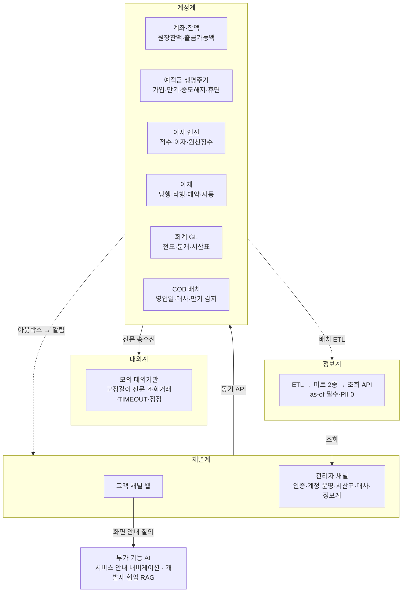

# CoreBank 2차 계획

> **이 파일이 정본인 것** — 2차 목표, 달력·마일스톤, 전 트랙 공통 규칙, 트랙별 인일, 지표, 범위 밖, 결정 로그, 미결 목록.
> **정본이 아닌 것** — 태스크별 소유자·인일·기한·범위·인터페이스 계약은 [tasks.md](tasks.md), 용어 이름은 [glossary.md](glossary.md).

기획 리드 P3 김다연 · 최종판 2026-09-23. 노션과 `plans/260916-corebank-phase2-v3/` 판본은 이 문서로 대체됐다.

## 0. 이 문서를 쓰는 법

- **사람:** §2 달력 → §4 자기 트랙 행 → [tasks.md](tasks.md) §1 자기 표 순서로 읽는다.
- **에이전트:** 태스크에 착수하기 전에 [tasks.md](tasks.md)에서 태스크 ID로 해당 절을 찾고, 이 파일 §3 공통 규칙을 확인한다. 문서끼리 어긋나면 [AGENTS.md](../../AGENTS.md) §1 우선순위를 따른다. **단, tasks.md의 "현황" 줄(코드 실측 기록)만은 예외다.** 현황 줄과 코드가 다르면 현황 줄이 낡은 것일 수 있으니 기준 커밋을 확인한 뒤 판단한다. 규약·설계와 코드가 다를 때는 AGENTS.md §1대로 코드가 틀린 것이다.
- **수정 규칙**
    - 계획은 PR로만 바꾼다. 태스크를 끝내는 PR에서 [tasks.md](tasks.md)의 상태와 현황을 함께 고친다.
    - 인일이나 스프린트가 바뀌면 이 파일 §4 합계도 같은 PR에서 고친다.
    - 결정이 바뀌면 §7에 새 `D-xx`를 추가한다. 옛 결정을 지우지 않고 "→ D-yy로 대체"라고 적는다.
    - 태스크 ID와 결정 ID는 재사용하지 않는다.

---

## 1. 2차에서 무엇을 하는가

두 축으로 간다. **① 은행 시스템의 4계 구조를 실 API로 갖춘다. ② 목데이터 300만 위에서 측정 → 개선 → 재측정으로 운영 가능성을 증명한다.**

| 계 | 2차에서 증명하는 것 | 담당 |
|---|---|---|
| 채널계 | 관리자 로그인·권한·계정 운영·시산표·대사·정보계 화면이 **실 API로** 돈다 | P1 인증·감사, P3 화면 |
| 계정계 | 회계 원장과 결함 주입 탐지, 이자·만기·중도해지, 출금가능액, COB 일 마감 | P3 · P2 · P5 |
| 대외계 | 모의 대외기관, TIMEOUT·정정 체인, 장애 3종에서 자금 정합성 100% | P4 |
| 정보계 | 마트 2종 + ETL + 조회 API, 기준시점(as-of) 필수, PII 0건 | P3 설계 · P5 구현 |
| 공통 보안·운영 | 아웃박스 유실 0, 감사 5W·WORM, 레이트리밋, 3-Tier 전환, 스케일아웃 실증, 메트릭 | 전 트랙 |

---

## 2. 달력과 마일스톤

| 스프린트 | 기간 | 영업일 | 성격 |
|---|---|---|---|
| S0 | 9/16~9/18 | (밖) | 정리 주. 관리자 골격·PH-97 부트스트랩 |
| **S1** | 9/21~10/2 | 7 | 기반·베이스라인. 추석 9/24~26, 대체휴일 9/28 |
| **S2** | 10/6~10/16 | 8 | 본체 구축. 10/5 대체휴일, 10/9 한글날 |
| **S3** | 10/19~10/30 | 10 | 전환(컷오버)·개선 사이클 |
| **S4** | 11/2~11/6 | 5 | 재측정·리포트. **새 BE 기능 금지** |
| 발표 준비 | 11/9~11/17 | — | 발표 자료·리허설. `terraform destroy` 시점은 [O-08](#8-미결) |
| **최종 발표** | 11/18 | — | 과정 최종 발표([D-24](#d-24--923--리드)) |

**날짜별 마일스톤.** 다른 트랙이 기다리는 것만 적었다. 전체는 [tasks.md](tasks.md) §1의 기한 칸에 있다.

| 날짜 | 들어와야 하는 것 |
|---|---|
| 9/30 | [PH-32](tasks.md#ph-32-도메인-이벤트-발행-골격) 이벤트 골격 · [PH-60](tasks.md#ph-60--ph-60b-목데이터) 최소 시드 · [PH-10](tasks.md#ph-10-계좌-상태-전이-매트릭스--flyway) 상태 Flyway · [PH-21](tasks.md#ph-21-전표-기표-구조--개시-잔액--분개-패턴표) 패턴 2종(TRF·SUB) + 개시 전표(OPN) → P6 |
| 10/1 | [PH-20](tasks.md#ph-20-계정과목-체계--gl-테이블) GL Flyway |
| 10/2 | [PH-99](tasks.md#ph-99-이체-파이프라인-확장점seam) seam(끝나는 대로 PH-80 S1분 착수) · [PH-49a-①](tasks.md#ph-49a-관리자-인증-①-결정스키마-102--②-구현-108) 관리자 인증 결정 · [PH-40](tasks.md#ph-40-영업일-도입--ph-41-거래일-컬럼) 영업일·거래일 컬럼 · [PH-50](tasks.md#ph-50-네트워크-terraform) 네트워크 plan·출력값 · [PH-60b](tasks.md#ph-60--ph-60b-목데이터) 300만 시드 · [PH-30](tasks.md#ph-30-k6-harness--이체-tps--동시성-정합성-s1-베이스라인--s4-재측정) harness |
| 10/6 | [PH-43](tasks.md#ph-43-cob-파이프라인) `CobStep` 인터페이스 · P5 → P4 회차 상태 현황 · [#379](tasks.md#379-규격-전달) 규격 → P5 · [EVT-2](tasks.md#evt-2-publishevent-두-줄) · [PH-38](tasks.md#ph-38-원장-대사-배치) 대사 베이스라인 |
| **10/8** | **전 트랙 개선 전 수치 마감** · [PH-49a-②](tasks.md#ph-49a-관리자-인증-①-결정스키마-102--②-구현-108) 머지 · [PH-80](tasks.md#ph-80-timeout--정정-체인--자동-재시도-금지) 머지·TIMEOUT 스키마 → FE · [PH-42](tasks.md#ph-42-correlation-id--로그-마스킹--json-로깅) |
| 10/12~16 | [HOOK-MERGE](tasks.md#hook-merge-훅-구현체-머지) — PH-90 → PH-24 → PH-41 대입 |
| **10/16** | **릴리스 1** · [PH-99](tasks.md#ph-99-이체-파이프라인-확장점seam) 입금 계약 · [PH-58](tasks.md#ph-58-엣지-계층) ACM ARN → P5 · [PH-12](tasks.md#ph-12-이자-계산기--절사-규칙) · [PH-90](tasks.md#ph-90-원장잔액--출금가능액-분리--transferprecheck) · [PH-24](tasks.md#ph-24-gl-분개-서비스--이체-기표-훅--glapi) · [PH-28](tasks.md#ph-28-시산표-api--베이스라인) · [PH-75](tasks.md#ph-75-정보계-마트-설계) 마트 스키마 · [PH-49c](tasks.md#ph-49c-세션-외부화) · [PH-38](tasks.md#ph-38-원장-대사-배치) 목록 API · PH-33 은행 스키마 → B-8 |
| 10/19~23 | [PH-51](tasks.md#ph-51-컴퓨트-계층--컷오버) apply 리허설 · C-6 → C-1 순서 · **10/21** [PH-72](tasks.md#ph-72-접근통제-인프라) Object Lock 버킷 → P1 |
| **10/23** | **릴리스 2** · [PH-15](tasks.md#ph-15-만기--감지--matured-전이--원리금--만기해지-api) 만기 · [PH-33-②](tasks.md#ph-33-대외계-①-모의-서버-s1--②-타행-이체-s3) 타행 이체 |
| **10/26~27** | **컷오버** — 10/26 apply + RDS 복원, 10/27 DNS 전환. **이틀 동안 전 트랙 측정 금지** |
| 10/28 | [PH-77](tasks.md#ph-77-정보계-조회-api) 정보계 API · 세션 Redis util 노드 확인 |
| **10/30** | **릴리스 3 = UAT 배포본** · [PH-16](tasks.md#ph-16-중도해지--휴면-전환--해지-시-자원-정리) 휴면 스텝 통합 |
| 11/6 | 6인 리포트. 기존 EC2 유지 종료 |
| 11/9 주 | [PH-48](tasks.md#ph-48-발표-자료) 발표 자료·리허설 |
| **11/18** | **최종 발표** |

---

## 3. 공통 규칙

### 3-1. 판정과 측정 환경

- 판정 흐름: **측정 → 문제점 → 원인 분석 → 후보 탐색 → 개선 → 재측정.** 개선 전 수치는 **10/8까지** 남긴다. 넘기면 리포트에 "베이스라인 미확보"라고 적는다.
- **성능 수치는 평균·p95·p99를 모두 적는다.** 양식은 [PH-30](tasks.md#ph-30-k6-harness--이체-tps--동시성-정합성-s1-베이스라인--s4-재측정) ④(P1 소유)를 쓴다.
- **개선 전/후는 같은 환경, 즉 기존 단일 EC2에서 잰다.** 락 튜닝·적수 집계·시산표 인덱스가 여기에 해당한다. 기존 EC2는 11/6까지 내리지 않는다.
- 3-Tier 수치는 두 곳에만 들어간다.
    - P4 리포트의 "환경 전환 효과" 한 줄
    - **P5 [PH-56](tasks.md#ph-56-was-스케일아웃-비선형성-실증) — 유일한 예외.** WAS 2대가 필요해서 3-Tier에서만 성립한다.
    - 이 밖에 P2 [PH-70-②](tasks.md#ph-70-rds-①-modulesdata-plan-s2--②-복원컷오버-s3)의 "새 RDS에서 적수 배치 1회"는 전환 확인용 기록이다. 개선 전/후 비교에 쓰지 않는다.
- 10/26~27은 측정하지 않는다. 컷오버가 실패하면 **Plan B**로 간다. P4·P5는 S4에 EC2에서 재측정하고, P5는 구축 진행률을 리포트한다.
- 목데이터 규모는 원장 300만(3개월) · 계좌 15만 · 분개 600만이다. 리포트에는 "300만 건 기준"이라고 적는다.

### 3-2. 이체 확장점 — `execute()`는 P4만 고친다

`TransferExecutionService.execute()`에는 다른 트랙이 **훅 구현체만 등록**한다. 훅 표·트랜잭션 경계·**머지 순서(PH-99 → PH-80 → PH-90 → PH-24 → PH-41 → PH-33-②)** 는 [PH-99](tasks.md#ph-99-이체-파이프라인-확장점seam)에 있다. 순서를 벗어난 `execute()` 수정 PR은 P4가 막는다.

- **GL 기표는 동기 포트다.** 원장과 같은 트랜잭션에서 기표하고, **기표 실패 = 이체 실패**다. `JournalPostingUseCase`는 예외를 삼키지 않는다.
- **자동 재시도는 금지다.** 응답이 불명확한 건은 재시도하지 않고 조회거래로 확인한다.

### 3-3. 이벤트·아웃박스

1. BEFORE_COMMIT 리스너가 아웃박스에 적재한다. **INSERT가 실패하면 원본 이체도 롤백된다.** 의도된 동작이다.
2. 리스너는 **`JdbcTemplate`로 INSERT**한다. JPA `persist`는 플러시 순서 때문에 실리지 않을 수 있다.
3. 실패 이벤트는 `failTransfer()`의 REQUIRES_NEW 안에서 발행한다. **`AFTER_COMMIT` 리스너는 없다.**
4. 릴레이는 `BatchExecutionLockPort`(ADR-0003)로 단일 인스턴스에서만 돈다.
5. 알림 유형은 기존 4종 그대로다. 만기·휴면·보안 알림은 없다.

### 3-4. 관리자 인증·감사

- **모델:** `customer.role` + `permissions` CSV. 권한은 고정 5종(`GL_READ · GL_WRITE · CUSTOMER_READ · CUSTOMER_WRITE · AUDIT_READ`)이다. 로그인은 `/admin/auth/login`으로 분리하고, 관리자 세션은 30분이다. 상세는 [PH-49a](tasks.md#ph-49a-관리자-인증-①-결정스키마-102--②-구현-108).
- **화면별 권한:** ADM-01 `CUSTOMER_*` · ADM-02 `GL_READ` · ADM-03 정보계 `GL_READ` · ADM-04 대사 `AUDIT_READ`
- **S0 임시 가드(#448)는 prod에 배포하지 않는다.** PH-49a-②(10/8)가 걷어낸다.
- **조회 사유:** 고객 개인정보 조회·변경 API에는 `X-Access-Reason` 헤더(enum 4종)가 필수다. 규약 표는 [PH-89](tasks.md#ph-89-감사-5w--조회-감사--조회-사유-강제)에 있다.
- 관리자 변경은 전부 기존 `AuditLog`를 거친다. 감사 IP는 신뢰 프록시 기준으로 기록한다(#458).

### 3-5. COB·배치

- **Spring Batch는 도입하지 않는다.** 기존 스케줄러 + `batch.api.CobStep` 체인 + 실행 기록 테이블로 간다. 스텝 순서표는 [PH-43](tasks.md#ph-43-cob-파이프라인)에 있다.
- 스텝 안의 서비스는 도메인 주인 것이다. P5는 러너·순서·재시작·실패 격리·soft/hard 정책·실행 기록을 소유한다. **각 스텝은 자기 트랜잭션을 연다.**
- 배치·AI 전용 노드는 없다. 배치는 WAS 1대에서 락으로 단일 실행하고, AI(FastAPI)와 Redis는 util 노드 docker에 둔다.
- 영업일은 `business.api.BusinessDateProvider`가 유일한 출처다. `LocalDate.now()` 직접 호출은 ArchUnit으로 막는다.

### 3-6. 금액·이자

- AGENTS.md 규칙 5를 따른다. 금액은 원 단위 정수(BIGINT)이고, 금리는 `BigDecimal` + `RoundingMode`다.
- 이자는 **만기·해지 시 일괄 지급**한다. 일 적립, 미지급이자 계정, COB 이자적립 스텝은 없다.
- 적수는 원장에서 즉시 집계한다. 일잔액 테이블은 만들지 않는다.
- 금리는 가입 시점 스냅샷 `applied_rate`만 쓴다.
- 수수료율과 세율은 yml에 둔다. 타행 수수료는 `FEE = 0L`로 유지한다.

### 3-7. API·FE 규약

- **2차 기간에는 응답 필드를 제거하거나 형태를 바꾸지 않는다(Expand-Contract).** 바꿀 때는 FE 스냅샷 PR을 동반한다. Flyway에서 `DROP`·`RENAME`은 금지다([PH-94](tasks.md#ph-94-expand-contract-규약)).
- correlation id: 헤더 `X-Correlation-Id`, MDC 키 `correlationId`
- 세션: Spring Session Redis. ALB 스티키 세션은 쓰지 않는다.
- FE 규칙
  1. codegen은 스냅샷을 읽는다([FE-SNAP](tasks.md#fe-snap-codegen-스냅샷)).
  2. MSW 목을 먼저 만드는 것은 BE가 다음 스프린트 이후일 때만이다. 2차 신규 화면은 시각 회귀 테스트 대상에서 뺀다.
  3. 순서는 C-6 → C-1이다. 파일 소유는 화면 주인이다.
  4. dev→main 릴리스는 **10/16 · 10/23 · 10/30**이고 서버·FE가 같은 날 한다.
- FE 레포에서는 이체 화면 파일 편집권·배분·순서를 P1(FE 리드)이 최종 조정한다. 화면 요구사항의 정본은 두 곳이다. 관리자 화면은 FE `docs/requirements-admin.md`, 고객 화면은 `corebank-design/docs/requirements.md`다. [tasks.md](tasks.md)의 FE 완료 기준은 그 문서의 인수기준을 가리키거나 한 줄로 요약한다.

### 3-8. 3-Tier 수명과 destroy

- 리허설(10/19)부터 발표 정리(11/9 주)까지 약 20일만 가동하고, 그 뒤 전부 `terraform destroy`한다. 예산 상한은 없다. **실행 주체는 P5**이고, S4에 리허설 1회를 한다([PH-55](tasks.md#ph-55-배포-파이프라인--destroy-리허설)).
- **destroy가 한 번에 끝나도록 다음을 반드시 설정한다**([D-08](#d-08--91920--p1p2p5)).
    - Secrets Manager는 `recovery_window_in_days = 0`으로 둔다. 기본값(30일 복구 유예)이면 삭제가 유예되고, 같은 이름으로 다시 만들 수도 없다.
    - CloudTrail 로그 버킷과 Object Lock 버킷에는 `force_destroy = true`를 준다. 객체가 남은 버킷은 삭제가 실패하기 때문이다.
    - Object Lock 버킷의 객체는 보존기간(1일)이 지나야 지워진다. 그 전에 destroy하려면 `s3:BypassGovernanceRetention` 권한이 필요하다. 그래서 destroy는 마지막 적재 후 1일이 지난 뒤에 한다.
    - Object Lock은 **GOVERNANCE 모드 · 보존 1일**
    - CloudFront는 비활성화 후 삭제까지 15~20분이 걸린다. destroy 순서에 반영한다.
- 인프라 경계
    - P5: VPC·서브넷·NAT 1개·SG·ALB·ASG(1~2)·util 노드·인스턴스 프로파일 2개·SSM 접속
    - P2: RDS 스냅샷 복원(Multi-AZ)·WAF·Route53·ACM·CloudFront·사람/CI/AI IAM·Secrets Manager·CloudTrail·Object Lock 버킷·DR
    - 상세는 [D-11](#d-11--920--p2p5)

### 3-9. 일정이 밀릴 때

야근으로 메우지 않는다. 아래 순서로 되돌린다. 사전에 빼는 목록이 아니다.

| 트랙 | 1순위 | 2순위 |
|---|---|---|
| P1 | PH-93 착수 안 함(조건부) | PH-96-② 구독 중 예약·자동이체 알림(#394·#395) |
| P2 | PH-14 원천징수 → 이자 지급만 | PH-13 집계 SQL 전환 |
| P3 | FE B-1① · B-8 | 시산표 인덱스 → 다음 PH-28b 4종 → 2종(편측기표·금액변조) |
| P4 | PH-36 3종 → 2종(타임아웃·중복응답) | PH-33 조회거래 |
| P5 | PH-56 핫스팟 곡선 → 일반 곡선만 | PH-77 → Swagger 스텁만 |
| P6 | 내비게이션 태스크 확정 때 정한다([O-07](#8-미결)) | — |

---

## 4. 트랙과 인일

환산 기준: BE S=2 · M=4 · L=7, FE(AI 도구) S=0.5 · M=1 · L=2. 가용량은 영업일 30일 × 6인 = 180인일이다. **총량 상한은 9/17에 해제됐다([D-01](#d-01--917--리드)) — 초과는 의도된 것이다.** 숫자는 [tasks.md](tasks.md) §1의 인일 합계다.

| P | 이름 · GitHub | 트랙 | 최종 리포트 | S1 | S2 | S3 | S4 | 합 |
|---|---|---|---|---|---|---|---|---|
| P1 | 주유나 `YounaJ00` | 알림 · 이벤트·아웃박스 · 관리자 인증·감사 · 품질 측정 · **FE 리드** | 품질·기록 리포트 | 11.5 | 10.25 | 19 | 6 | **46.75** |
| P2 | 정선우 `vsopsw` | 예적금 생명주기 · 이자 · 출금가능액 · RDS · 엣지·접근통제·DR | 원리금 정확도·잔액 체계 리포트 | 6.5 | 7.5 | 19.5 | 5.5 | **39** |
| P3 | 김다연 `danhandev` | 회계 GL · 정보계 설계 · **기획 리드(PM 주 0.5일)** · 관리자 화면 | 회계 통제+정보계 리포트 · 발표 | 7.5 | 8.5 | 7.75 | 5.5 | **29.25** |
| P4 | 이건 `astrokan` | 이체 코어 · 확장점 · 타행 이체 · 대사 | 정합성+성능 리포트 | 6 | 6 | 8 | 3 | **23** |
| P5 | 류재성 `bprosefan` | COB · 영업일 · 네트워크/컴퓨트 · 정보계 ETL·API · 운영 | 배치+인프라 리포트 | 7.5 | 10.5 | 11.5 | 7 | **36.5** |
| P6 | 장영훈 `cy389` | 목데이터 · 서비스 안내 내비게이션 · 세션 외부화 · MFA 정의 | AI 품질 리포트 | 7 | 8 | 8 | 2.5 | **25.5** |
| **합** | | | | 46 | 50.75 | 73.75 | 29.5 | **200 / 180 (111%)** |

**밀도(인일 ÷ 영업일).** 1.0을 넘으면 한 사람이 그 스프린트에 낼 수 있는 양보다 많다는 뜻이다.

| P | S1 (7) | S2 (8) | S3 (10) | S4 (5) |
|---|---|---|---|---|
| P1 | 1.64 | 1.28 | **1.90** | 1.20 |
| P2 | 0.93 | 0.94 | **1.95** | 1.10 |
| P3 | 1.07 | 1.06 | 0.78 | 1.10 |
| P4 | 0.86 | 0.75 | 0.80 | 0.60 |
| P5 | 1.07 | 1.31 | 1.15 | 1.40 |
| P6 | 1.00 | 1.00 | 0.80 | 0.50 |

- **S3가 P1·P2에 몰려 있다([O-05](#8-미결)).** P4는 7인일의 완충이 있지만 새 범위로 채우지 않는다([D-14](#d-14--92123--p4-제안-리드-승인)).
- 1차 잔여 이슈는 이 합계에 넣지 않았다([tasks.md §3](tasks.md#3-1차-잔여--2차-인일-밖)).
- P6 합계 25.5는 약관 RAG 태스크 기준이다. 내비게이션으로 바뀐 몫([D-22](#d-22--923--팀-합의멘토-제출-기획서))은 같은 인일 안에서 다시 나누고, 세부는 [O-07](#8-미결)에서 정한다. 협업 RAG([D-23](#d-23--923--리드))는 이 합계 밖이다.

---

## 5. 지표

"개선 전"은 10/8까지 채운다. 성능 지표는 p99를 포함한다.

| 지표 | 소유 | 개선 전 | 목표 | 측정 방법 · 환경 |
|---|---|---|---|---|
| 이벤트 유실률 | P1 | AFTER_COMMIT 시뮬레이션(10/8) | 0 | 발행 직후 강제 종료(S4) |
| 알림 유실률 · 중복률 | P1 | — | 0 · 0 | 1만 건 주입 |
| 미문서화 API 건수 | P1 | S1 전수 목록 | 0 | Swagger 전수 |
| 마스킹 미적용 응답 필드 | P1 | S3 측정 | 0 | 응답 DTO 스캔(#410) |
| 테스트 커버리지 | P1 | #382 | 재측정만 | JaCoCo |
| FE codegen CI 파손 | P1 | #142 1회 | 0 | 스냅샷 도입 후 |
| 조회 전용 ADMIN의 변경 API 거부율 · 권한 부여/회수 감사 기록률 | P1 | — | 100% · 100% | 권한 검사 테스트 |
| 조회 감사 5W 기록률 | P1 | — | 100% | PH-89 |
| 무차별 로그인 차단률 · 오탐률 | P1 | — | 100% · 기록 | 1만 건 주입(PH-08) |
| WORM 삭제·수정 거부율 | P1 | — | 100% | Object Lock(PH-82) |
| 지연이체 정상 지급률 | P1 | — | 100% | PH-06 |
| **이체 TPS / p95 / p99 · 데드락률 · 잔액 오차 · 원장 짝** | P1 측정 · P4 리포트 | 10/8 | 개선 · 오차 0 · 100% | PH-30 harness, 단일 EC2 |
| 원리금 계산 오차 | P2 | — | 0원 | 15만 계좌 전수 대조 |
| 적수 계산 시간 | P2 | 단건 루프(10/6) | 단축 | 집계 SQL, 단일 EC2 |
| 상태 전이 매트릭스 · 불법 전이 차단 | P2 | — | 60/60 · 100% | 위반 시나리오 15종 |
| 출금가능액 정확도 | P2 | — | 100% | 지급정지 시나리오 |
| 중도해지 처리 오차 | P2 | — | 0원 | PH-16 |
| 개인정보 컬럼 암호화 적용률 · 조회 저하율 | P2 | — | 100% · 기록 | PH-18 |
| DR Tier별 RTO/RPO 달성 | P2 | — | Tier별 판정 | 페일오버·복구 훈련 |
| 결함 주입 탐지율 | P3 | — | 100% | 4종 |
| 시산표 집계 시간(600만 분개) | P3 | 10/8 | 단축 | 인덱스 1건, 단일 EC2 |
| 회계 커버리지 | P3 | — | 100% | 이체·상품가입·타행 미결제·이자 |
| 마트 ↔ 원장 정합성 · 마트 PII | P3 · P5 | — | 일치 · 0건 | 합계 대조 · 스캔 |
| UAT 통과율 | P3 | — | 측정 | 10/30 배포본 |
| 장애 3종 자금 정합성 유지율 | P4 | — | 100% | 모의 대외계 |
| 대사 실행 시간(300만) | P4 | 10/6 | 기록 | 단일 EC2 |
| `execute()` 순환복잡도 | P4 | #381 이후 | 재측정 | 정적 분석 |
| COB 소요시간(15만 계좌) | P5 | 10/16 순차 | 단축 | 순차 → 청크 → 병렬, 단일 EC2 |
| 배치 실패 복구 | P5 | 전체 재실행 | 스텝 단위 | 실행 기록 |
| WAS 스케일아웃 효율 — 일반 vs 핫스팟 | P5 | 1대 | 곡선 2개 | **3-Tier**(예외) |
| 단일 EC2 → 3-Tier 전환 효과 | P5 · P4 | 10/8 | 기록 | TPS·p99 한 줄 |
| 정보계 ETL 적재 시간 · 응답 기준시점 | P5 | — | 기록 · 100% | 300만 원장 |
| 로그 민감정보 노출 · 알람 인지 시간 · 배포 다운타임 | P5 | — | 0 · 기록 · 0 | PH-42 · PH-47 · PH-55 |
| 돈이 나가는 버튼 자동 실행 · 고객 데이터 저장 | P6 | — | 0건 · 0건 | 허용 목록 검사 · 저장소 스캔([D-22](#d-22--923--팀-합의멘토-제출-기획서)) |
| 내비게이션 목표 화면 도달률 | P6 | — | 90% 이상(잠정) | 평가 시나리오([O-07](#8-미결)) |
| 협업 RAG 정답 문서 top-5 포함률 · 문서 변경 반영률 | P3 | — | 90% 이상(잠정) · 100% | 평가 질문([D-23](#d-23--923--리드)) |
| 목데이터 적재 시간 · WAS 2대 세션 유지 | P6 | — | 기록 · 유지 | PH-60b · PH-49c |

---

## 6. 2차에서 만들지 않는 것

"Stretch"가 아니다. **2차 안에 하지 않는다.** 다시 넣으려면 팀 회의에서 §4를 다시 맞추고 §7에 결정을 추가한다.

| 영역 | 만들지 않는 것 |
|---|---|
| 감사·기록 | PH-46 커맨드 선기록(#372는 참고로 열어 둔다) · 감사 조회 API · NTP·JSON 정규화 · PH-05 커버리지 개선 |
| 계좌·이자 | PH-07 입금계좌 지정(기능 자체가 2차에 없다) · PH-17 휴면 화면·세부 정책 · PH-91 Saga · 만기후이율 · 비과세 구분 · 우대금리 판정 · 미결제 차감 · 관리자 계좌 조회 API(FE #131 계좌 탭 대응 BE. 태스크 PH-19b와 무관) |
| 데이터 계층 | Read Replica · ElastiCache · PH-53 커넥션풀·슬로우쿼리 · PH-78 읽기·쓰기 분리 |
| 회계 | PH-25 마감잔액 · PH-26 결산 · PH-27 역분개 · PH-83·84 별도 규약 · PH-98 판매중지 API · PH-88 모놀리식 ADR · 탐지 주기 단축 |
| 대외계 | PH-35 미결제 정산·차액결제 · PH-86 장애 등급 문서 · 장애 주입 부분실패·순서역전·지연 · 타행 수수료 · PH-81 데이터 분류표 · PH-52 보존정책 · PH-95 Cache Stampede |
| 배치·인프라 | Spring Batch · 휴일 등록 API · 처리일·기표일(거래일만) · PH-44 마감 중 차단 · #371 실행 기록 조회 API · 배치·AI 전용 노드 · 파티션 생성 COB 스텝 · PH-39 메트릭 소비 측 |
| RAG | PH-64 튜닝·임베딩 비교 · 리랭킹 · PH-74 상품 색인 · AI 로그 조회 API · AI CI/CD · HWP 파싱 · 평가셋 150/거부 30 · 만기·휴면 알림 |
| 관리자 | 회원가입 관리(가입 대행·목록) · 조회 사유 자유기재 · maker-checker 전면 도입 · MFA·Step-up 구현(정의만) |
| FE 화면 | #129 결산·역분개·권한 관리 · #130 감사로그·AI 로그·결함 주입 탭 · #131 고객·계좌·알림 이력 · #132 마스터 관리 · B-1② · B-2 · B-4 · B-5 · B-6 · B-7 · B-10 · B-11 · C-3 · C-4 · C-9. C-8은 종결 |

---

## 7. 결정 로그

출처가 "리드"면 기획 리드(P3)의 결정이다. 날짜는 결정일이다.

### D-01 · 9/17 · 리드

총량 상한(154.5인일)과 트랙당 26인일 상한을 폐지했다. 총량 때문에 뺐던 14개를 복원했다: PH-06 · PH-08 · PH-49b · PH-82 · PH-16 · PH-18 · PH-45 · #365 · PH-47 · 로그 마스킹 · PH-55 · PH-58 · PH-72 · PH-54.

### D-02 · 9/17 · 리드

PH-58 · PH-72 · PH-54를 P5에서 P2로 옮겼다. P5가 59인일로 치우치는 것을 막기 위해서이고, 설정·문서·훈련 비중이 크며 P2가 이미 RDS를 다룬다.

### D-03 · 9/18 · P1·P4 합의

PH-30(k6 harness · TPS·p95·p99 · 동시성 #384 · #385) 전체를 P1이 소유한다. 구 PH-81b(p99 리포트 양식)는 PH-30 ④다. P4는 수치를 받아 리포트만 한다. **PH-99(seam)는 P4에 남는다.**

### D-04 · 9/18 · P1·P3

FE B-1① · B-8 · #130-①(ADM-04) · C-2를 P1에서 P3로 옮겼다(편집권과 PR·머지 포함). C-2와 ADM-04는 S3로 옮겼다. FE #136(로그인 훅)은 P1에 남는다.

### D-05 · 9/23 · 리드

P5 재배치를 승인했다. PH-85·PH-94는 S2 → S1, PH-55 본체는 S3 → S4다. PH-55는 CI/CD·훈련이라 S4 규칙에 걸리지 않는다. P5 S4의 "RDS 페일오버 1회"는 삭제했다(P2 PH-54 소관).

### D-06 · 9/18 · 리드

PH-07(입금계좌 지정)은 어느 트랙도 하지 않는다. 규제 필수는 PH-06(지연이체)이다. 1차 limit 연결 검증은 PH-30 ②-b로 대신한다.

### D-07 · 9/19 · P1·P2

PH-08의 "IP 단위 전역 요청량 제한"을 P2 PH-58 WAF로 옮겼다. 계정 열거 차단용 **IP+아이디 조합** 카운터는 P1에 남는다. 공수 재산정은 [D-13](#d-13--918--리드)에서 했다.

### D-08 · 9/19~20 · P1·P2·P5

Object Lock은 GOVERNANCE 모드·보존 1일이다. Object Lock 버킷은 생성 시 versioning이 필요하다. 잠긴 객체까지 지우는 `s3:BypassGovernanceRetention` 권한은 destroy 실행 역할에만 주고, 앱의 적재 역할에는 주지 않는다(주면 WORM 검증이 무의미해진다). 삭제·수정 거부 검증은 P1(PH-82)이 한다. destroy가 막히지 않도록 Secrets Manager 복구 유예 0일, 로그·Object Lock 버킷 `force_destroy`, CloudFront 삭제 순서를 반영한다(§3-8). 설정은 P2가 하고, destroy 리허설과 실행은 P5가 한다.

### D-09 · 9/23 · 리드

ADM-03 정보계 대시보드와 PH-77의 권한은 `GL_READ`다. 권한 집합 5종은 늘리지 않는다(FE 요구사항 1안).

### D-10 · 9/23 · 리드

조회 사유는 `X-Access-Reason` 헤더와 enum 4종으로 받는다. 대상은 고객 개인정보 조회·변경 API다. 헤더에는 한글을 담을 수 없고, 쿼리에 두면 URL과 액세스 로그에 남기 때문이다. 상세는 [PH-89](tasks.md#ph-89-감사-5w--조회-감사--조회-사유-강제).

### D-11 · 9/20 · P2·P5

IAM·SSM 경계.

- P5: EC2 인스턴스 프로파일 2개(WAS·util)와 SSM Agent·Session Manager 접속 기반
- P2: 사람·CI·AI IAM, Secrets Manager, CloudTrail, MFA, 자격증명 회전
- PH-51 출력값은 ALB ARN · 리스너 ARN · DNS name · zone ID이고, ACM certificate ARN은 P2 → P5다.

### D-12 · 9/23 · 리드(P2 회신 채택)

휴면 전환 스텝은 만기감지 바로 다음 자리다. P5가 10/16에 자리를 비워 두고, P2가 **10/30까지 통합**한다. S4에는 검증만 한다(S4 새 BE 코드 금지).

### D-13 · 9/18 · 리드

P1의 PH-89(2.5) · PH-03(1) · PH-93(1.5, 조건부)을 복원했다. 감사 조회 API는 복원하지 않는다(소비 화면이 범위 밖). 9/23에 이 문서가 P1 worklist(47인일) 숫자를 두 곳 고쳐 적용했다: 영업일 표기 40 → 30, PH-08 4 → 3.5(IP 전역 제한이 WAF로 빠진 몫). 여기에 worklist에 없던 FE #136(0.25)을 더해 46.75다. 원본 worklist 파일은 고치지 않았다.

### D-14 · 9/21~23 · P4 제안, 리드 승인

P4는 PH-30이 빠지면서 25.5 → 21.5인일이 됐다. PH-33-①을 S1으로 당겼다. 이후 코드 실측(PR #463이 불일치를 로그만 남김)으로 PH-38 S2를 1 → 2일로 늘려 22.5인일이다. **남은 7.5일은 완충으로 두고 새 범위로 채우지 않는다.** 이어서 9/23 검수로 두 가지를 더했다: PH-80을 S1 1.5 / S2 2.5로 나눴다(10/8 머지까지 S2 영업일 3일). P2 이자·만기·해지용 `transfer.api` 입금 계약(0.5, S2)을 추가해 23인일이고 완충은 7일이다.

### D-15 · 9/20 · P4·P5

PH-43의 선행에서 PH-38을 뺐다(선행이 서로를 기다리는 순환 해소). P4가 `CobStep` 인터페이스(10/6)를 받은 뒤 대사 스텝을 등록한다.

### D-16 · 9/20 · P4·P5

파티션이 2027-12까지 선반영돼 있다(PR #427). 그래서 COB 파티션 스텝은 두지 않는다. P4는 규격과 이 판단을 10/6까지 P5에 넘긴다.

### D-17 · 9/23 · 리드

PH-75 마트 스키마를 10/21에서 10/16으로 당겼다. P5 PH-76·77이 10/26~27 컷오버를 피해서 실가용일 3일 안에 끝나야 하기 때문이다.

### D-18 · 9/23 · 리드

#475(상품가입 토큰 mock)는 P3 S1이다. #458(감사 IP)은 P1 PH-89에 포함한다. FE 이슈를 정정했다: #130 → P3, #136 → P1, #129 · #131 · #132는 not planned로 닫았다.

### D-19 · 9/17 · 리드

다음 네 가지를 정했다.

- PH-46 커맨드 선기록은 범위 밖이다.
- PH-70은 RDS 1개 스냅샷 복원으로 축소한다.
- 3-Tier는 P5가 Network/Compute를, P2가 Data를 맡는다.
- PH-97은 계정 운영까지만 한다. 회원가입 관리는 만들지 않는다.

### D-20 · 9/18 · 리드

S0 관리자 임시 가드는 prod에 배포하지 않는다. prod QA 계정은 10/16 릴리스 이후에 만든다. CORS `*.pages.dev`는 허용하지 않는다(#448 코멘트).

### D-21 · 9/23 · 리드

2차 계획의 정본은 `docs/phase2/`(이 파일 · tasks.md · glossary.md)다. 노션과 트랙별 문서는 폐기한다.

### D-22 · 9/23 · 팀 합의(멘토 제출 기획서)

P6의 AI 기능을 약관 RAG에서 **서비스 안내 내비게이션**으로 바꾼다. 질문을 받아 해당 화면으로 이동하고 입력 칸을 안내한다. 지키는 선은 두 가지다. 돈이 나가는 버튼은 누르지 않는다(대신 실행할 동작은 허용 목록으로 제한). 계좌번호·잔액 같은 고객 데이터는 저장하지 않는다(화면 구조만 저장).

- 약관 RAG 태스크 PH-22' · PH-61 · PH-29' · PH-62 · PH-63 · PH-65 · PH-73 · PH-66과 FE B-1①(상품 RAG 챗)은 이 결정으로 대체된다.
- P6 인일 합계는 그대로 두고, 태스크 분해·인일·지표·§3-9 되돌리기 순서는 [O-07](#8-미결)에서 정한다.

### D-23 · 9/23 · 리드

**개발자 협업 RAG**(`plans/260918-ai-wiki-rag`)를 2차 범위에 넣는다. 소유는 P3다. 1단계(레포 문서 18개·537청크 색인, Qdrant + embeddinggemma, MCP 도구)는 9/22에 배포됐고 §4 인일 밖이다. 남은 일은 PR #466(문서 동기화 워크플로) 머지와 팀원 SSM 권한 부여다.

### D-24 · 9/23 · 리드

과정 최종 발표는 **11/18**이다. 11/9 주는 발표 자료와 리허설 기간이다. PH-48 기한도 이에 맞춘다.

---

## 8. 미결

| ID | 질문 | 누가 | 언제까지 |
|---|---|---|---|
| O-01 | FE `docs/requirements-admin.md` 정정 PR(FE #159) — ① §3 POL-A09 조회 사유 필수 ② §4 REQ-ADM-019 신설 ③ §5 EX-A03 해제 ④ §5 EX-A13 근거 수정(D-10) ⑤ ADM-03 `GL_READ`(D-09) ⑥ ADM-04 담당 P3(D-04) ⑦ #129·#131·#132 닫힘 반영(D-18) ⑧ 인용 경로를 v3에서 `docs/phase2`로. FE 코드 주석(`src/mocks/handlers/admin.ts`, `src/shared/types/admin-permission.ts`)의 v3 경로도 함께 고친다 | P3 | 9/30 |
| O-02 | glossary의 제안 명칭 `inquiry`(조회거래) · `correction`(정정 체인) · "처리 불명"(TIMEOUT) 확인 | P4 | PH-80 전(10/8) |
| O-03 | AWS 계정 소유자 확인 | P5 | PH-50 전(10/2) |
| O-04 | 대사 불일치 알림 채널 — 지금은 로그만 남긴다(PR #463 리뷰 6). PH-47 알람 규칙에 넣을지 | P5 · P4 | PH-47(S2) |
| O-05 | 밀도가 높은 구간 — P1 S1 1.64 · P1 S2 1주차(PH-49a-②가 10/6~8 3일에 3인일이라 여유 0) · P1 S3 1.90 · P2 S3 1.95. 10/8과 10/16 진척을 보고 §3-9 순서를 적용할지 | 리드 | 10/8 · 10/19 |
| O-06 | FE B-8(P3)과 B-9(P1)가 같은 디렉터리에 있다 — 파일 경계 | P1 | S3 전 |
| O-07 | 내비게이션 태스크 분해 — 태스크·인일(합계 25.5 안), LLM 모델과 호출량(기획서 예산은 월 $50 한도), OpenSearch 사용 여부, 평가 시나리오 수와 목표 화면 도달률, §3-9 되돌리기 순서 | P6 | 9/30 |
| O-08 | 11/18 최종 발표 시연 환경 — 3-Tier `terraform destroy` 시점과 기존 EC2 유지 기간(지금은 11/6 종료)을 발표일에 맞출지 | P5 · 리드 | 10/19 |
| O-09 | PH-06 지연이체가 즉시이체를 보류로 돌리는 자리 — 컨트롤러 단에서 예약이체로 위임할지, `execute()`에 새 훅을 둘지. PH-99 seam에는 자리가 없다(훅 A는 읽기 전용) | P1 · P4 | PH-06 착수 전(10/16) |
